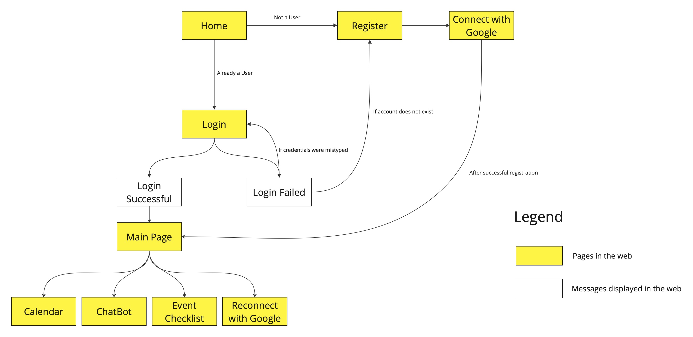
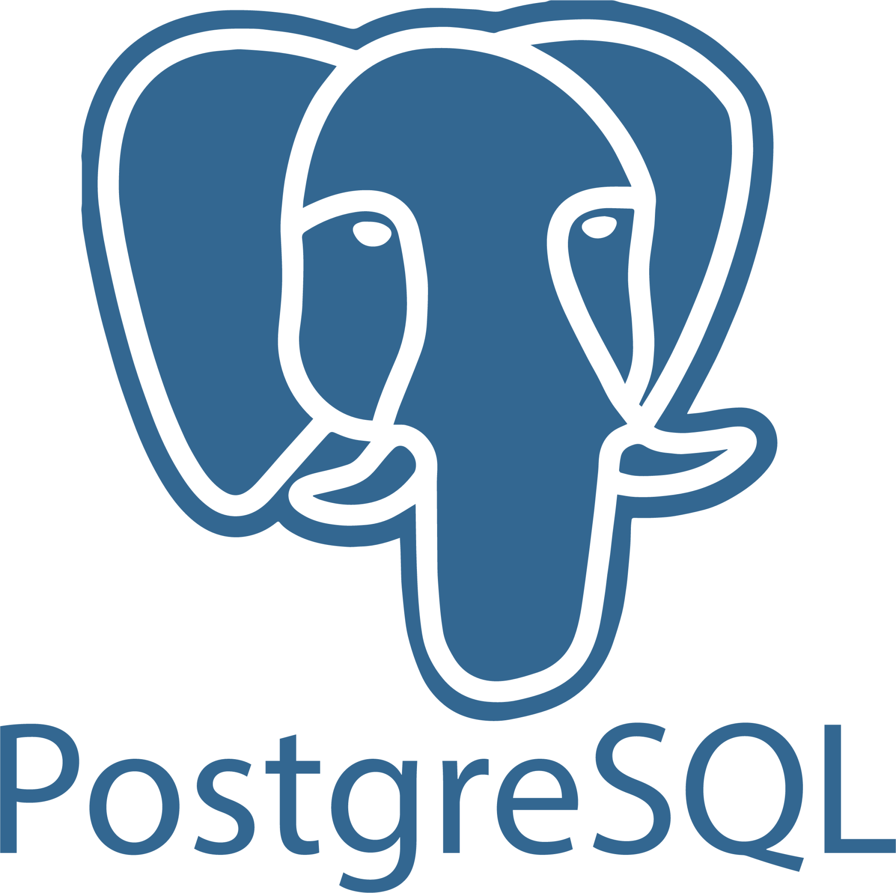
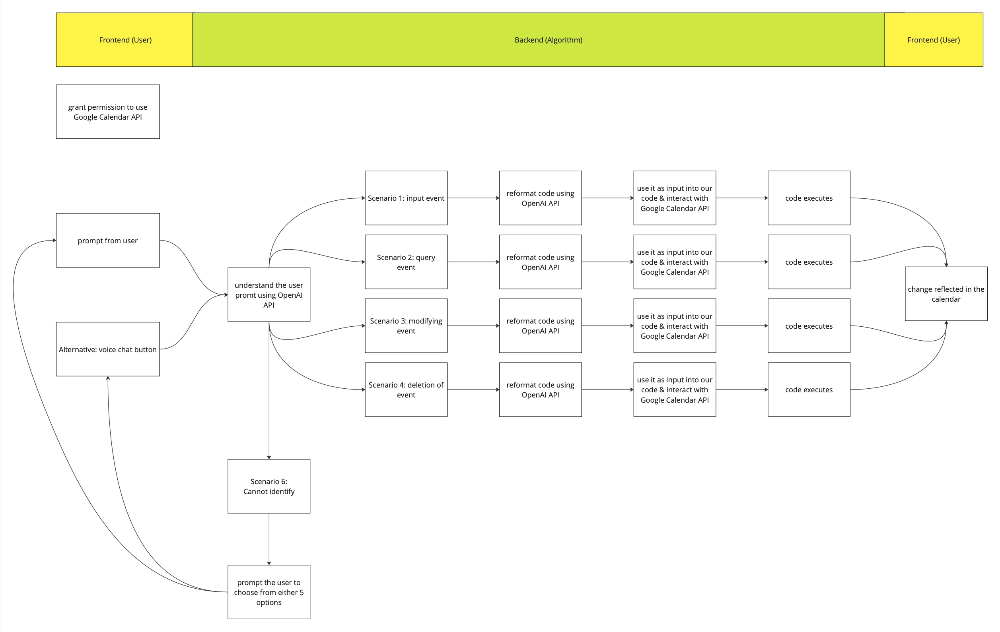
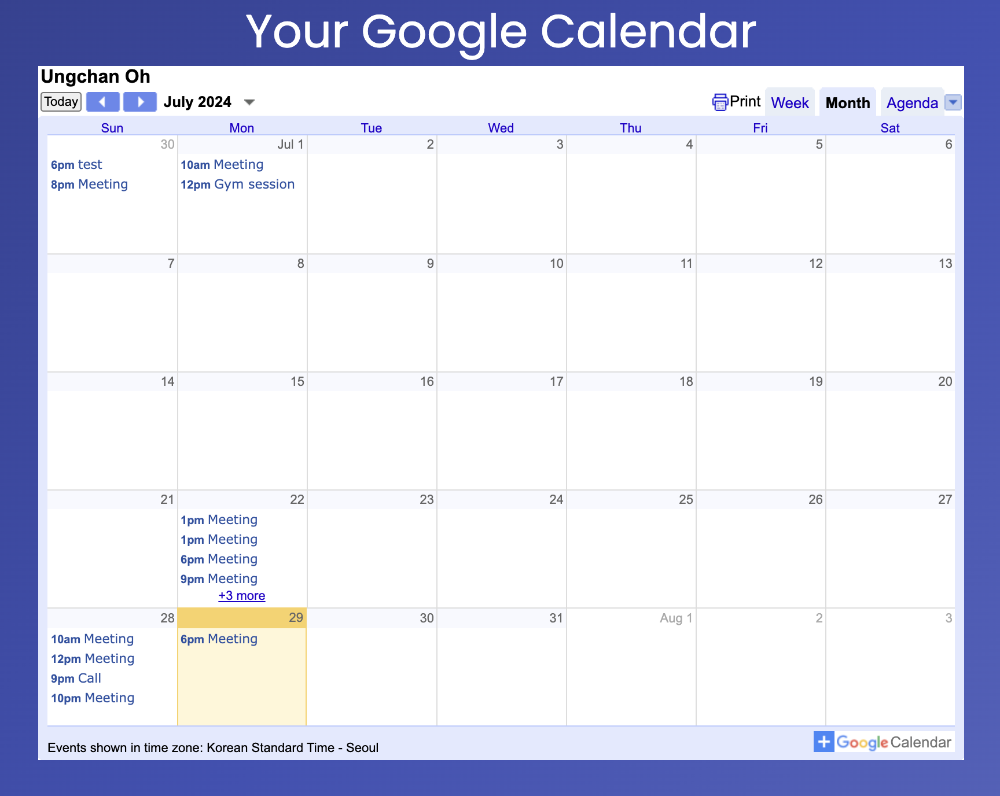
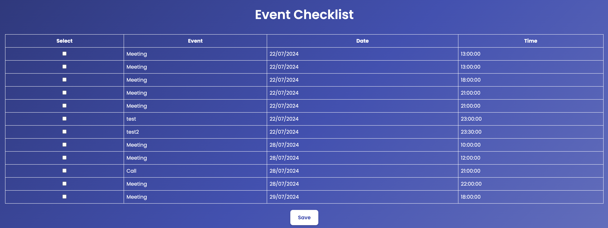
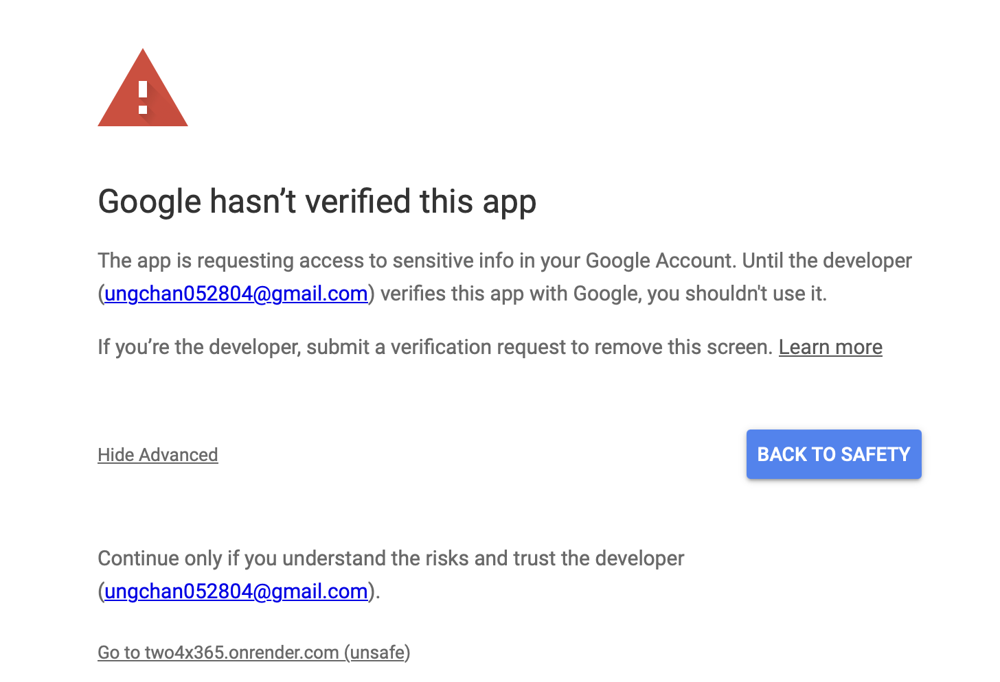

# Team Name

24X365

# Proposed Level of Achievement

Gemini

# Aim

An app to make time planning easy, fulfilling and habitual. Powered by OpenAI.

# Motivation

24 Hours. Time is one of the few things that are distributed equally to every person. Each day, everyone is given 24 hours. Nevertheless, the way individuals utilize this time can significantly impact the outcomes of their lives.

Upon entering university, we recognized the value of time as a valuable asset. Spending 5 hours in classes, 3 hours engaging in hall activities, and an additional 3 hours on coding assignments... Without effective time optimization and planning, navigating such a fast-paced, high-stress setting would be challenging.

# Vision

The purpose of our 24 X 365 app is to make time planning easy, fulfilling and habitual. Our target audience is endless - anyone that wishes to utilize their time in a more productive way. 

Our innovative app, 24 X 365, is designed to seamlessly integrate into your daily routine, helping you organize your time effectively and achieve your goals with ease. Whether you're a student looking to balance study and leisure, a professional aiming to boost productivity, our user-friendly interface caters to individuals from all walks of life.

# User Stories

As a student, I want to track my study hours and breaks, so I can maintain a balanced study schedule.

As a busy professional, I want to be able to easily plan and follow my schedules. 

As a person seeking to be disciplined, I would like to be held accountable and build habits. 

As a person that has a tight schedule, I would like to be able to view my schedule conveniently.

As a person that lives a hectic lifestyle, I would like to add things to my schedule more conveniently and quickly.

# Features

1. User Registration
2. Connect with Google
3. Main Page
4. View Calendar
5. ChatBot- various features
6. Checklist

# Flow of the Web App

# Tech Stack

<table>
  <tr>
   <td>Frontend- React JS
   </td>
   <td>
     

   </td>
  </tr>
  <tr>
   <td>Backend- Django
   </td>
   <td>

   </td>
  </tr>
  <tr>
   <td>Database- PostgreSQL
   </td>
   <td>

   </td>
  </tr>
  <tr>
   <td>Version Control- GitHub
   </td>
   <td>

   </td>
  </tr>
  <tr>
   <td>Web Hosting- Render
   </td>
   <td>

   </td>
  </tr>
</table>

# Features

## User Registration

[Proposed]

Our proposed user registration and authentication involves using the token authentication provided by Django REST framework's rest_framework.authtoken module.

Users first have to register to create an account, and login using that account. Upon logging in, users would be brought to the main page, which is specific for every user. In that page, it will contain different tabs that contain the different features.

[MS1 Progress]

We have managed to successfully set up the user authentication as proposed.  As for the steps after successful login, we have only managed to create 2 buttons (that will only be visible once login). The 2 buttons are: the Chatbot interface, and a Calendar interface.

[MS2 Progress]

On top of the 2 buttons, we have created another button: Continue with Google (Google Authentication)

[MS3 Progress]

We have modified the flow of the registration. Upon successful registration, users will be directed to connect with Google. Upon successful connection, it will bring the users to the main page. There is no need for users to login again.

[Problems]

We have considered changing the user registration to using only Google Sign-in. However, it requires a different mechanism, and the database would have to be greatly modified to keep track of the users. It was too late for us to make the change. As such, we are sticking to our original way of user registration.

## Connect with Google

[Proposed]

Our proposed authentication with Google involves using Google’s OAuth 2.0 framework. OAuth 2.0 is an industry-standard protocol for authorization, providing a secure way to grant websites or applications access to users' information without exposing their passwords.

Once users connect with Google, the web application would be able to use the user’s token to make changes to the Google Calendar. 

[MS1 Progress]

Did not start for MS1.

[MS2 Progress]

We have successfully made the feature that allows users to be connected with Google. Our code stores the tokens generated for each user. It also handles token expiration and refresh tokens appropriately. 

The tokens generated are able to be used in the code that allows events to be added using our ChatBot.

[MS3 Progress]

After every hour of connecting with Google, the token generated previously requires refreshing. As such, the code has been updated such that users only need to click on the ‘Connect with Google’ button to refresh the token, and it is done instantaneously, without the users needing to click on anything else.

## Main Page

[Proposed]

Our proposed main page aims to include the various pages such that it is intuitive and simple for the users to navigate through them.

[MS3 Progress]

We have made the main page, and created a navigation bar that contains all the different pages. This allows easier navigation between the pages.

An example of the Home Page:

## 

## ChatBot

[Proposed]

Our proposed chatbot aims to be able to receive messages from users in natural human language. The beauty in this lies in the LLM being able to extract data from unstructured data. 

Once the prompt is passed into the LLM, it would extract details such as date, time and description. Then it would utilise function calling to call relevant functions in our code base. The functions would then interact with the Google Calendar API to trigger the adding of new events. 

Other than adding events, there are other possible scenarios, and all of them would be accounted for in our final product.

Below is how the flow of the chat feature would look like:

 

[MS1 Progress]

We have created a basic chatbot frontend that is able to take in messages. However, the output of the messages is still fixed. We aim to integrate OpenAI into the chatbot by the end of Milestone 2.

Furthermore, we have done prompt engineering to extract relevant data from unstructured user inputs, i.e purpose, event name and time. These data will then be pipelined into our custom code to serve different purposes. This is still in progress. Our immediate priority would be to ensure one scenario, i.e add event, to function with the front end. 

We have also connected to the Google Calendar API. The credentials file have been stored in the environment file so as to not expose it to the public. As for the adding of the events, we are still troubleshooting some issues. We aim to integrate the Google Calendar API to at least be able to add events using the Chatbot and OpenAI API by the end of Milestone 2.

[MS2 progress] 

Our chatbot can now understand users’ intentions and add events correspondingly. A confirmation message with the relevant details will be sent before interacting with users’ Google Calendar. 

Next, we will aim to integrate more functions into the chatbot, i.e deleting events, modifying events and retrieving events from the calendar. 

[MS3 progress] 

In the final milestone of our project, the chatbot is able to delete, modify, and retrieve events based on users' prompts, marking a substantial improvement in its functionality and user interaction. This advancement, however, didn't come without its challenges.

To accommodate these new features, we had to expand the function calling capabilities of our system. This expansion led to some unforeseen complications. We noticed that the chatbot occasionally struggled to accurately interpret user queries, sometimes resulting in unintended functions being called. To address this issue, we undertook a comprehensive rewrite of our prompts. Our goal was to provide better guidance to the LLM, helping it more accurately understand and respond to user queries. We developed a set of guidelines and reminders for the LLM to follow, which has significantly improved its performance.

[Problems]

While most of the newly implemented functions are working well, we've identified event modification as an area that still needs improvement. Currently, in about 70% of cases, users need to first retrieve an event before they can successfully modify it. For instance, a user might need to ask about events scheduled for tomorrow before they can request a modification to one of those events. We recognize this as a potential point of friction in the user experience and have marked it as a priority for future refinement.

The retrieval of events, which is also crucial for deletion and modification operations, presented its own set of challenges. Two main issues we encountered were: 

* converting human time concepts into machine-readable formats
* matching events in the calendar to users' descriptions, which can often differ significantly from the stored event names, e.g a user might refer to a "badminton" event as a "game".

To tackle these challenges, we engineered an innovative prompt chaining solution. This approach involves breaking down complex tasks into multiple subtasks, which has proven effective in improving the model's accuracy. Specifically, we created two key functions: “parse_date_range” and “find_best_matching_event”. These functions work together to process user inputs and find the most relevant events in the calendar. By integrating these functions into our main chatbot logic, we've created a pipeline that can handle a wide range of user queries more effectively.

## 

## Calendar

[Proposed]

Our proposed calendar aims to allow users to be able to view their schedules and tasks. Users should be able to view the calendar from the Month, Week, Day.

Upon adding events using the Google Calendar API, our calendar should be able to show the events that have been added too.

[MS1 Progress]

We have created a calendar frontend that shows the month view, and the ability to toggle to the previous or the next month. We aim to be able to show the added events in our calendar by the end of Milestone 2.

[MS2 Progress]

We have managed to connect to Google Calendar, and embedded the calendar that is specific for each individual user. In the calendar, the users are able to view the calendar according to Month, Week and Agenda (the task they have for each day).

An example of Monthly View:

[MS3 Progress]

No changes made from MS2.

## Checklist

[Proposed]

Our proposed checklist empowers users to conveniently view their pending tasks and effortlessly mark them as completed once accomplished. This feature provides a satisfying sense of progress, motivating users to stay on track with their schedule and maintain a productive workflow.

[MS1 Progress]

Did not start for MS1.

[MS2 Progress]

Did not start for MS2.

[MS3 Progress]

For the frontend, the details of the events are shown in a tabular format, and clicking on the respective boxes would create a strikethrough. In case of any misclicks by the user, the events will only be removed once the user clicks on the ‘save’ button.

For the backend, the events are fetched from the Google Calendar directly through a series of querying. The list of events span from 7 days before, to the current date. Once the user clicks on ‘save’, the eventID of the respective events are retrieved, and is removed from the Google Calendar.

To give users a sense of accomplishment, once all the outstanding events have been marked as completed, it will display a congratulatory message.

An example of the Checklist Page:

# Software Engineering Practices

<table>
  <tr>
   <td>Version Control
   </td>
   <td>Managed changes to source code over time, enabling ourselves to track modifications, revert to previous versions, and collaborate efficiently between the 2 of us. There were times we needed  to revert back, and this was a very useful tool for us.
   </td>
  </tr>
  <tr>
   <td>Branching
   </td>
   <td>Utilized branches for new features and merging code branches within a version control system. Instead of directly merging to the main branch, which could cause merge conflicts.
   </td>
  </tr>
  <tr>
   <td>Issues Tracking
   </td>
   <td>Utilized GitHub Issues to track bugs, features throughout the development lifecycle. It also helped in the allocation of the features to work on for the both of us.

   </td>
  </tr>
  <tr>
   <td>Sprints
   </td>
   <td>Allocated about equal workload between the 2 of us, and set a date to update on the progress. We had a meeting every week to update each other on the status and any issues faced.

[More details can be found in the Project Log]
   </td>
  </tr>
  <tr>
   <td>Testing
   </td>
   <td>Conducted User Testing 

[More details can be found in the Testing Page]
   </td>
  </tr>
</table>

# Testing

For our user testing, we sent out our web application for other users to try. Afterwards, the users completed a Google Forms regarding the responsiveness and usability of our web application.

The following questions were asked:

* Are you able to register an account?
* Are you able to authenticate with Google?
* Are you redirected to the main page upon connecting with Google?
* Does refreshing the main page bring back to the tab that you were in?
* How responsive and accurate is the chatbot in adding events?
* How responsive and accurate is the chatbot in deleting events?
* How responsive and accurate is the chatbot in updating events?
* Does the user calendar tab successfully retrieve your calendar and events?
* Does the events checklist successfully list your upcoming events?
* Does checking the box and clicking on save remove the event from the checklist?
* It is easy to understand how the app works. (Linear scale question)
* It is easy to navigate between the different pages. (Linear scale question)
* Any other feedback?

We have collated the response inside the following spreadsheet:

[https://docs.google.com/spreadsheets/d/1eZCYJoM_ZpHge97S6YN7s3Xb8pg4JSePmJ8rFY7tzwA/edit?usp=sharing](https://docs.google.com/spreadsheets/d/1eZCYJoM_ZpHge97S6YN7s3Xb8pg4JSePmJ8rFY7tzwA/edit?usp=sharing)

# Deployment

Link to our website: [https://two4x365-1.onrender.com](https://two4x365-1.onrender.com)

We used Render for our web app’s deployment. During the deployment process, we had to link our GitHub repository, and connect our backend and frontend separately. We needed to create a requirements.txt file which contains the dependencies for the django backend, and a production build for our React JS frontend.

Render also provided an environment variable, where we could store our API and secret keys.

During the deployment, we had to use a database that is stored online, and we migrated to PostgreSQL (from SQLite) which was also available on Render.

We managed to solve the problem of direct refreshing that was present in Milestone 2. It is now possible to enter pages directly or by refreshing them.

[Problems]

As we are using the free service meant for individuals, the backend will take about 50 seconds to load after a while of inactivity. As such, if the login/registration is not responding, please wait for a minute.

We are using a free version of PostgreSQL which only gives us access for 1 month. As such, we have switched to another database. Please complete the user registration again even if it was already done in Milestone 2.

We have published our application on the Google API console. However, in order to verify our app, we would have to come up with privacy policies and terms & conditions. As such, please click on the advanced button, and click on the ‘Go to …’.

   

# Links

Video:

[https://drive.google.com/file/d/1nPgDKaYJhMtTBhYryHQU5YT_8afbKipd/view?usp=sharing](https://drive.google.com/file/d/1nPgDKaYJhMtTBhYryHQU5YT_8afbKipd/view?usp=sharing)

Poster:

[https://drive.google.com/file/d/14e3_bSNFAKc80kdHfvDbXkPvsVoNHry1/view?usp=sharing](https://drive.google.com/file/d/14e3_bSNFAKc80kdHfvDbXkPvsVoNHry1/view?usp=sharing)

GitHub:

[https://github.com/lim-4158/24x365](https://github.com/lim-4158/24x365)

Project Log:

[https://docs.google.com/spreadsheets/d/1BBY4SHbIUAiaBK4-g5kY06LW02SeCoirPrtKCuQjIHY/edit?usp=sharing](https://docs.google.com/spreadsheets/d/1BBY4SHbIUAiaBK4-g5kY06LW02SeCoirPrtKCuQjIHY/edit?usp=sharing)

Web Application:

[https://two4x365-1.onrender.com](https://two4x365-1.onrender.com)
